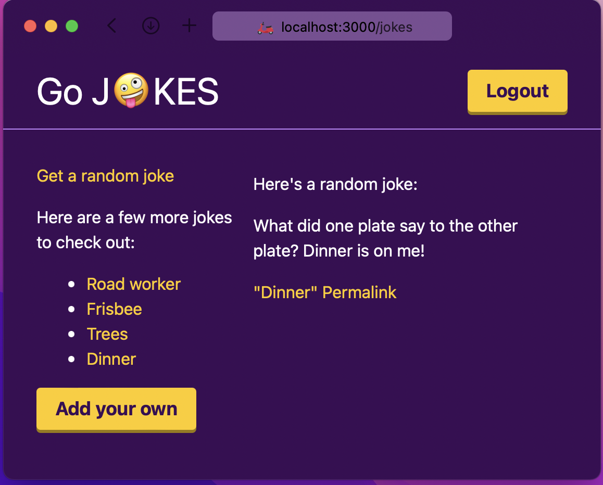

# Remix Jokes - Go Edition

[Remix](https://remix.run) is a React framework for building web applications. I used my momentum after learning Remix by building [Thankful](https://github.com/Fghurayri/thankful) to rebuild their [Jokes](https://github.com/remix-run/remix-jokes) app in Go.

In summary, the application is a trivial CRUD app that allows authenticated users to browse and add jokes.

From the Go side, I was pleased by the typing system and how the compiler was helping me explore the language and assisting me towards having a functional code!

## Project Structure

The following is the folder structure for the project.

```sh
.
├── html
│   ├── auth.go.html
│   ├── index.go.html
│   ├── jokes
│   │   ├── index.go.html
│   │   ├── joke.go.html
│   │   └── new.go.html
│   └── layouts
│       ├── jokes.go.html
│       ├── nav.go.html
│       └── root.go.html
├── lib
│   ├── db
│   │   └── db.go
│   ├── handlers
│   │   ├── auth.go
│   │   ├── handlers.go
│   │   ├── index.go
│   │   └── jokes.go
│   ├── models
│   │   ├── joke.go
│   │   └── user.go
│   └── utils
├── main.go
└── readme.md
```

Moreover, this project has 4 different packages:

- The `handlers` package is responsible for all the HTTP side.
- The `models` package is responsible for modeling the domain.
- The `utils` package is responsible for all the _helpers_ needed.
- The `db` package is responsible for all stuff related to the DB.

I must say that this is _not_ a best practice. I am not even sure about this organization. However, this feels ok now.

## What I Learned

Learning a new language by building a web CRUD application may seem dull. However, having _simple_ requirements in a controlled scope is powerful to focus on what's more important - learning the language!

Rebuilding the Remix Jokes app in Go allowed me to explore the **rich** standard library. Moreover, I have a better understanding of packages VS folders VS files. Finally, I got to experience how to integrate 3rd party libraries into my application.

To build a simple CRUD web application, you need an HTTP server, a way to serve some HTML files dynamically, and a mechanism to persist and manipulate your data.

### The `net/http` Standard Package

The `net/http` standard package helps in serving web requests.

```go
http.HandleFunc("/", Index)
http.ListenAndServe(":3000", nil)
```

The above snippet enables serving web requests on port `3000` on the `/` path by executing the `Index` handler.

### The `html/template` Standard Package

The `html/template` package helps serve HTML templates with dynamic data and reusable layout.

```go
	t, _ := template.ParseFiles(files...)
	t.Execute(w, d)
```

The above snippet enables parsing any number of `go.html` files and allows for the `{{}}` syntax to have dynamic HTML.

### The `Gorm` ORM

Although the Go standard library supports working with SQL DBs using `database/sql`, I decided to go with Gorm as the ORM in this CRUD application. The reason is to get a taste of using (install, read the docs, and utilize) external libraries.

```go
type User struct {
	gorm.Model
	Username     string
	PasswordHash string
	Jokes        []Joke
}
```

The above snippet helps create the user model, which reflects the `users` table with a one-to-many relationship.
